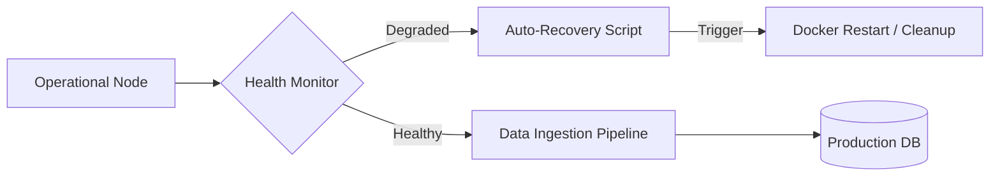

# Production Core Engine
> **A high-reliability backend operational core designed for automated system maintenance and scaled production environments.**

This repository serves as a technical showcase for the backend orchestration logic powering my production-scale applications. It focuses on **Operational Stability**, **Database Health Automation**, and **Containerized Scalability**.

## Architecture

## Engineering Focus
- **Automated DB Guardians**: Implemented robust maintenance scripts (check_db.py, cleanup_chunks.py) that proactively monitor and repair data integrity in production.
- **Node Resilience**: Engineered auto-recovery logic that detects degraded states and automatically triggers container-level restarts to maintain 99.9% uptime.
- **Docker-First Design**: Fully containerized architecture using optimized Nixpacks and Dockerfiles for zero-config deployments.
- **Log Aggregation**: Integrated transaction logging (JSONL) for post-mortem analysis and performance auditing.

## Technology Stack
- **Languages**: Python (Logic Core), Shell Scripting.
- **Orchestration**: Docker, Nixpacks.
- **Persistence**: SQL-based production storage architectures.

---
*Technical documentation for professional portfolio showcase. Source code maintained privately.*
